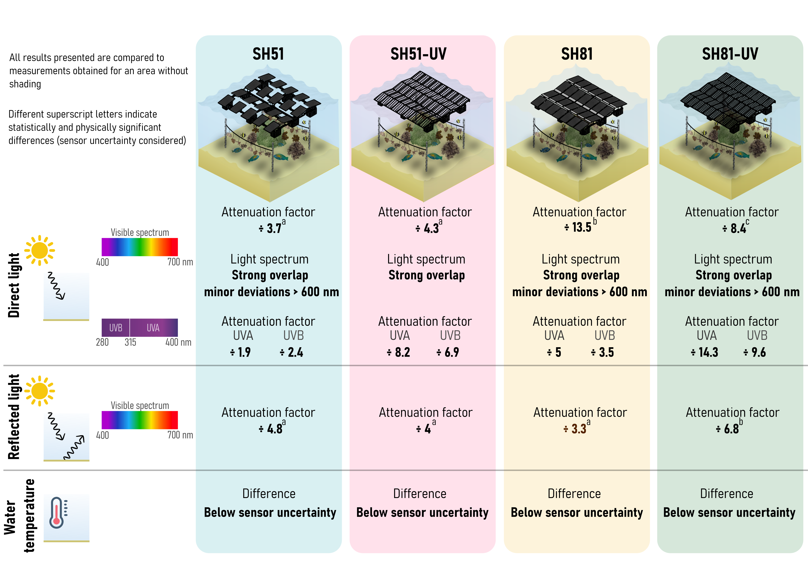

# The Effect of Shading by Floating PV on Light and Temperature in a Tropical Lagoon 

 **Mathieu Adgé1\*, Laetitia Hédouin1, Etienne Drahi2, Serge Planes1,3**

1 EPHE-UPVD-CNRS, PSL Research University, USR 3278 CRIOBE, Papetoai, Mo'orea 98729, French Polynesia  
2 TotalEnergies OneTech, Courbevoie, 92400, France  
3 Maison des Sciences de l'Homme du Pacifique (MSH-P), Université de la Polynésie française, 98702 French Polynesia

<figure>
  
  <figcaption><em>Abstract :  Floating photovoltaic (FPV) systems deployed in saltwater environments represent a promising renewable energy solution for remote regions, like coral reef island but their environmental effects remain poorly documented. Here, we conducted a year-long empirical assessment of FPV impacts on underwater light regimes and water temperature in a coral reef lagoon using four platforms with contrasting shading and UV-filtering configurations. FPV installations substantially reduced direct light reaching the seafloor. Platforms engineered to provide similar shading exhibited comparable direct-light attenuation at a given position, although spatial heterogeneity beneath most of the structures resulted in additional attenuation. In contrast, reflected light was more homogeneous across platforms and appeared primarily influenced by local substrate topography, with differences between shading levels smaller than those observed for direct light. UV attenuation followed a clear gradient among platforms, whereas spectral modifications within the photosynthetically active radiation range were minor and limited to wavelengths above 600 nm. No effect of FPV installations on water temperature was detected. Overall, FPV systems induce multiple, interacting modifications of the underwater light environment. While this complexity constrains the isolation of individual ecological drivers under in situ conditions, our results provide a robust physical framework for assessing the potential ecological impacts of FPV installations in coral reef ecosystems.</em></figcaption>
</figure>

## Structure of the repository : 

**Code** : 
- *direct_light_analysis.Rmd* : This code permits to make the analysis about direct light and to produce the figures (Fig.3) and the appendices (F1,F2,F3,F4)

- *light_position_analysis.Rmd* : This code permits to make the analysis about the effect of several position on the attenuation factor and to produce the figures (Fig.4, Fig.5 and Fig.7)

- *reflected_light_analysis.Rmd* : This code permits to make the analysis about reflected light  and to produce the figure (Fig.6) and the appendices (F5,F6,F7)

- *temperature_analysis.Rmd* : This code permits to make the analysis about the effect of shading on water temperature and to produce the appendix (F8)

- *UV_plot.Rmd* : This code permits to produce the figure (Fig.8)

- *light_spectrum.Rmd* : This code permits to produce the figure (Fig.9)
